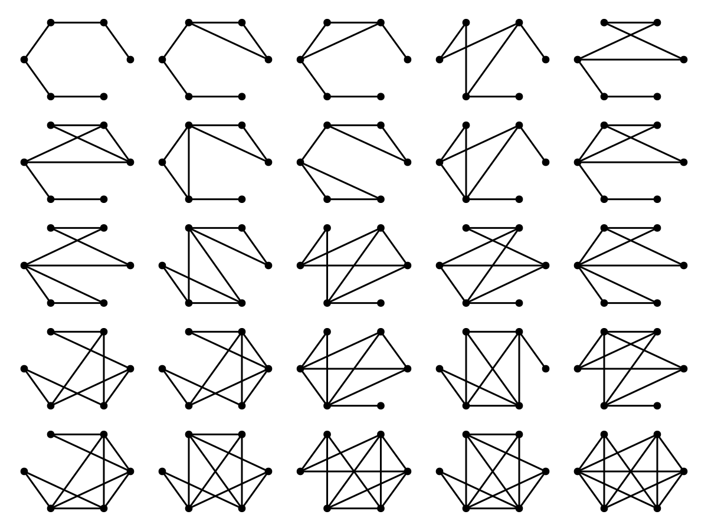

# Orbits of Graph States under Local Complementation

A Julia wrapper for the databases of quantum graph states equivalent under local complementation from

- https://www.ii.uib.no/~larsed/entanglement/ (related to https://arxiv.org/abs/1011.5464)
- https://zenodo.org/records/3757948 (related to https://arxiv.org/abs/1910.03969)


All of the wrapped resources are under the original authors's copyright.
This repository is just for convenient hosting and wrapping in a Julia library.

## Installation

Install julia using [`juliaup`](https://julialang.org/downloads/). Then, from the julia terminal press `]` to enter "package mode" and type `add LCOrbits`. If you want the currently unpublished dev version of the library do `add https://github.com/QuantumSavory/LCOrbits.jl` instead.

## `lcorbits_summary`

Use to get the database from `arxiv:1011.5464`, containing the equivalency classes of graph states (i.e. orbits), without explicitly listing all the graph states in each orbit.

However, the minimal edge state and minimal chromatic index state for each orbit are listed.

Keys are:

- `EC` - the equivalency class index (in the standard order suggested by the authors)
- `orbitsize` - the size of the orbit
- `vertices` - the number of vertices of the graph
- `contains2color` - whether there is a two colorable graph in the orbit
- `minedges` - the minimal edges (and the corresponding chromatic index, and how many non-isomorphic graphs have that property)
- `minchromidx` - the minimal chromatic index (and the corresponding number of edges, and how many non-isomorphic graphs have that property)
- `same_min_edgeschromidx` - whether the previous two are the same
- `schmidtmin` - Schmidt measure lower bound
- `schmidtmax` - Schmidt measure upper bound
- `schmidtsame` - whether the bounds match
- `minedge_repr` - the minimal edge representation
- `minedge_repr_colors` - coloring for the minimal edge representation
- `minchromidx_repr` - the minimal chromatic index representation
- `minchromidx_repr_colors` - coloring for the minimal chromatic index representation
- `same_min_edgeschromidx_repr` - whether the minimal edge representation and the minimal chromatic index representation are the same
- `bipartrankidx6` - rank index for bipartite splits with 6 vertices in the smaller partition
- `bipartrankidx5` - rank index for bipartite splits with 5 vertices in the smaller partition
- `bipartrankidx4` - rank index for bipartite splits with 4 vertices in the smaller partition
- `bipartrankidx3` - rank index for bipartite splits with 3 vertices in the smaller partition
- `bipartrankidx2` - rank index for bipartite splits with 2 vertices in the smaller partition
- `cardmult` - the cardinality-multiplicities

### Example: plotting a minimal edge representation state from a given orbit

```julia-repr
julia> using LCOrbits, GraphMakie, CairoMakie

julia> orbits = LCOrbits.lcorbits_summary(10); # only graphs of size 10

julia> orbit42_10 = orbits[42,:] # the 42nd orbit
DataFrameRow
 Row │ EC     orbitsize  vertices  contains2color  minedges     ⋯
     │ Int64  Int64      Int64     Bool            NamedTuple   ⋯
─────┼────────────────────────────────────────────────────────────────────────────────
  42 │   628        120        10            true  (minedges = 9, chromidx = 5, size ⋯

julia> graphplot(orbit42_10.minedge_repr; edge_color=orbit42_10.minedge_repr_colors)
```


## `lcorbits_full`

Use to get the database from `arxiv:1910.03969`, which includes the entirety of each orbit (each graph state in the orbit, not only the minimal states).

Keys in addition to `lcorbits_summary` are:

- `orbit` - a list of all graphs (up to isomorphism) in the orbit
- `orbit_metagraph` - the orbit itself shown as a graph
- `orbit_metagraphedgeops` - a mapping from an edge of the orbit metagraph to the list of local complementations that perform the transition (TODO unfinished)

### Example: plotting the metagraph describing the states and possible complementations in a given orbit

```julia-repl
julia> using LCOrbits, GraphMakie, CairoMakie, NetworkLayout

julia> df = LCOrbits.lcorbits_full();

julia> i = findfirst(>(20), df.orbitsize) # find the first orbit with more than 20 states
12

julia> firstlargeorbit = df[i,:];

julia> graphplot(firstlargeorbit.orbit_metagraph)
```


### Continuing example: plotting all the states in the given orbit

```julia-repl
julia> f = Figure()

julia> n = firstlargeorbit.vertices
6

julia> for (i,g) in enumerate(firstlargeorbit.orbit)
           x = ((i-1)÷5)+1
           y = rem(i-1,5)+1
           a = Axis(f[x,y])
           graphplot!(a,g;layout=Shell())
           hidedecorations!(a)
           hidespines!(a)
       end

julia> current_figure()
```


